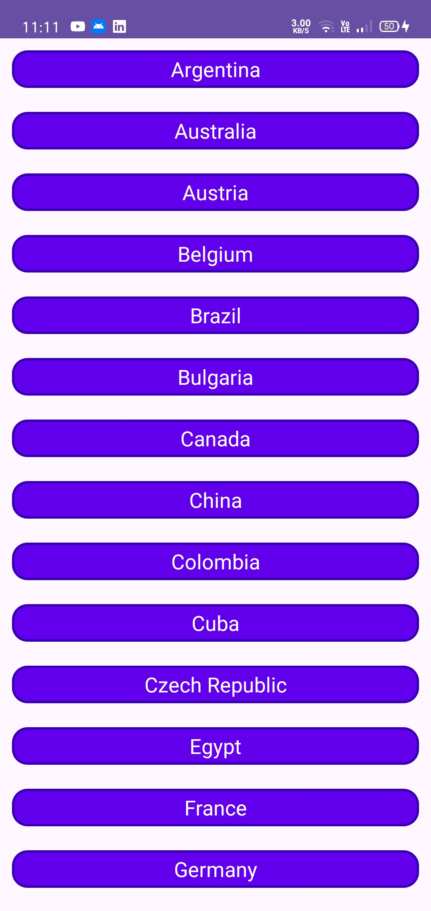
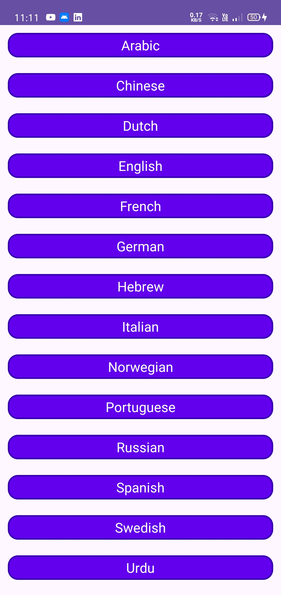
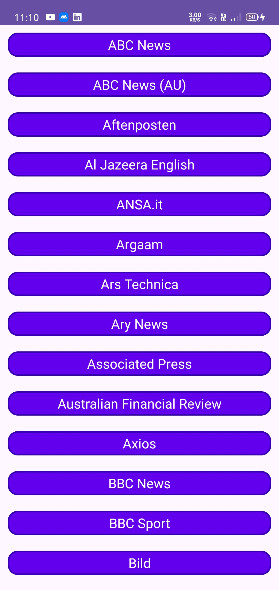

# NewsApp

A native Android news reader built with Kotlin and the NewsAPI.org REST API. Browse top headlines by country, language, or source, search for articles by keyword, and open any story straight in the browser.

## Screenshots

| Home | Top Headlines | Search |
|---|---|---|
|  |  |  |

| Country List | Language List | Source List |
|---|---|---|
|  |  |  |

## Features

- **Top Headlines** — latest headlines for a country (defaults to `us`)
- **Browse by Language / Country / Source** — pick a criterion from a list, then view matching headlines
- **Search** — free-text search across articles as you type
- **Read full article** — opens the source article in a Chrome Custom Tab
- **Response caching** — an OkHttp interceptor caches network responses and serves cached data when offline

## Tech Stack & Architecture

The app follows **MVVM + Repository pattern**, organized into `data` / `domain` / `ui` layers:

- **Kotlin**
- **MVVM** — `ViewModel` + `StateFlow` exposing a sealed `UiState` (`Loading` / `Success` / `Error`) to each screen
- **Repository pattern** — `NewsRepository` (domain) / `NewsRepositoryImpl` (data) abstract the API from the UI
- **Dagger 2** — constructor-based dependency injection via hand-written `ApplicationComponent` / `ActivityComponent`
- **Retrofit + OkHttp + Gson** — networking and JSON parsing
- **OkHttp response caching** — `CacheInterceptor` / `ForceCacheInterceptor` cache network responses and serve them from disk when offline
- **Kotlin Coroutines + Flow** — async calls and reactive state
- **ViewBinding** — type-safe view access, no `findViewById`
- **Glide** — image loading for article thumbnails
- **AndroidX Browser (Custom Tabs)** — in-app article reading

> **Note:** This branch (`master`) uses Dagger 2. A migration to **Hilt** is underway on the [`migration/dagger-to-hilt`](https://github.com/v4patil/-NewsApp-MVVM-Architecture/tree/migration/dagger-to-hilt) branch — see the [commit-by-commit migration guide](https://github.com/v4patil/-NewsApp-MVVM-Architecture/compare/master...migration/dagger-to-hilt) for how each Dagger component/module/ViewModel was converted.

## Project Structure

```
app/src/main/java/com/vibhorpatil/newsapp/
├── MainActivity.kt              # Home screen — entry point to the four flows below
├── NewsApplication.kt           # Application class, builds the Dagger ApplicationComponent
│
├── data/                        # Data layer — talks to the network, knows nothing about UI
│   ├── api/
│   │   └── NetworkService.kt        # Retrofit endpoints (top-headlines, everything, sources)
│   ├── interceptor/
│   │   ├── CacheInterceptor.kt      # Adds Cache-Control headers to responses
│   │   └── ForceCacheInterceptor.kt # Serves cached data when there's no network
│   ├── model/
│   │   ├── Article.kt
│   │   ├── NewsSource.kt
│   │   ├── NewsSourceResponse.kt
│   │   └── TopHeadLineResponse.kt
│   └── repository/
│       └── NewsRepositoryImpl.kt    # Implements domain.repository.NewsRepository
│
├── domain/                      # Domain layer — pure Kotlin, defines the app's contracts
│   ├── model/
│   │   └── NewsCriteria.kt          # Country/Language/Source list item shown in NewsCriteriaActivity
│   └── repository/
│       └── NewsRepository.kt        # Interface the ViewModels depend on
│
├── di/                          # Dependency injection (Dagger 2)
│   ├── component/
│   │   ├── ApplicationComponent.kt  # @Singleton, provides the network/repository graph
│   │   └── ActivityComponent.kt     # @ActivityScope, injects each Activity
│   └── module/
│       ├── ApplicationModule.kt     # Provides OkHttpClient, Retrofit, NetworkService, NewsRepository
│       ├── ActivityModule.kt        # Provides ViewModels and Adapters per Activity
│       ├── qualifiers.kt            # @ApplicationContext / @ActivityContext / @BaseURL
│       └── scopes.kt                # @ActivityScope
│
├── ui/                          # Presentation layer — one package per screen
│   ├── base/
│   │   ├── UiState.kt               # Sealed Loading/Success/Error wrapper used by every ViewModel
│   │   ├── Extension.kt             # SearchView -> Flow helper for debounced search
│   │   └── ViewModelProviderFactory.kt
│   ├── topheadline/
│   │   ├── TopHeadlineActivity.kt
│   │   ├── TopHeadLineViewmodel.kt
│   │   └── TopHeadLineAdapter.kt
│   ├── newscriteria/                # Shared screen for Country / Language / Source lists
│   │   ├── NewsCriteriaActivity.kt
│   │   ├── NewsCriteriaViewModel.kt
│   │   └── NewsCriteriaAdapter.kt
│   └── search/
│       ├── SearchActivity.kt
│       ├── SearchViewModel.kt
│       └── SearchAdapter.kt
│
└── utils/
    ├── AppConstant.kt           # API key, default country, filter-type constants
    └── WebServiceConstant.kt    # Base URL and endpoint path constants
```

**Resources** (`app/src/main/res/`): standard `layout/`, `drawable/`, `values/`, plus `raw/countries.json` and `raw/languages.json`, which back the "browse by country/language" lists.

## Getting Started

1. **Clone the repo**
   ```bash
   git clone https://github.com/v4patil/-NewsApp-MVVM-Architecture.git
   ```
2. **Get a NewsAPI key** from [newsapi.org](https://newsapi.org/) (free tier is enough).
3. **Set the API key** in `app/src/main/java/com/vibhorpatil/newsapp/utils/AppConstant.kt` (`API_KEY`).
4. Open the project in **Android Studio** (Koala or newer recommended), let Gradle sync, and run the `app` module on an emulator or device (**minSdk 24**, **targetSdk/compileSdk 35**).

## Data Source

All content is fetched from [NewsAPI.org](https://newsapi.org/) — `top-headlines`, `top-headlines/sources`, and `everything` endpoints (see `NetworkService.kt`).